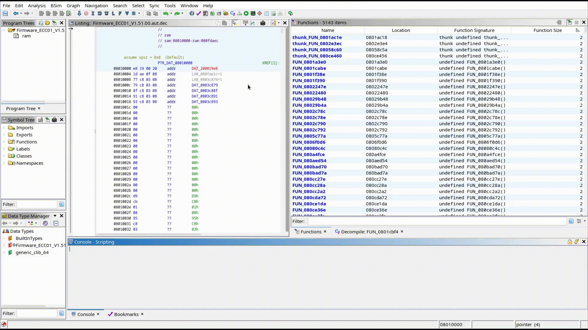

<div align="center">


# SightHouse

**Recover function names, prototypes, and library origins in binaries across IDA, Ghidra, and Binary Ninja.**

[](https://pypi.org/project/sighthouse-client/)
[](https://github.com/quarkslab/sighthouse/blob/main/LICENSE)
[](https://quarkslab.github.io/sighthouse/)

</div>

SightHouse helps reverse engineers understand unknown binaries by matching their functions
against a database of known signatures. When it finds a match, it tells you the original
function name, its prototype, and which library or framework it came from.

Unlike hand-curated signature sets, SightHouse keeps its database up to date **automatically**:
it continuously scrapes, compiles, and analyzes open-source or proprietary projects, 
and then lets you match any binary against it from your favorite reverse-engineering tool.



## How it works

SightHouse is split into three components, each serving a different need:

- **SRE Clients**: plugins for [IDA Pro](https://hex-rays.com/), [Ghidra](https://github.com/NationalSecurityAgency/ghidra),
  and [Binary Ninja](https://binary.ninja/) that query a SightHouse server from inside your
  disassembler and annotate matched functions.
- **Frontend**: a self-hostable API server that answers signature queries from the clients,
  backed by a signature database.
- **Signature Pipeline**: the automated engine that grows the database: it scrapes open-source
  projects (e.g. from PlatformIO), compiles them, and extracts function signatures using
  [Ghidra BSIM](https://blog.quarkslab.com/bsim-explained-once-and-for-all.html).

## Which part do I need?

| Your goal | Component to install | Get started |
| --- | --- | --- |
| Query a binary for known functions from your disassembler | **SRE Clients** | [Client quickstart](https://quarkslab.github.io/sighthouse/clients/quickstart/) |
| Host your own SightHouse server against an existing database | **Frontend** | [Frontend quickstart](https://quarkslab.github.io/sighthouse/frontend/quickstart/) |
| Build your own signature database and signatures | **Signature Pipeline** | [Pipeline quickstart](https://quarkslab.github.io/sighthouse/signature-pipeline/quickstart/) |

Most users only need the **SRE Clients**. Not sure? Check the docs **[quarkslab.github.io/sighthouse](https://quarkslab.github.io/sighthouse/)**.

## Installation

SightHouse is available on PyPI. Install only the component you need:

```bash
pip install sighthouse-client     # SRE clients (IDA, Ghidra, Binary Ninja)
pip install sighthouse-frontend   # Frontend API server
pip install sighthouse-pipeline   # Signature pipeline
pip install sighthouse[all]       # Everything
```

### Installing an SRE client plugin

After installing `sighthouse-client`, register the plugin for your disassembler:

```bash
# IDA
sighthouse client install ida --ida-dir /path/to/ida_dir

# Ghidra (requires Ghidra 11.3+ with pyGhidra)
sighthouse client install ghidra --ghidra-install-dir /path/to/ghidra

# Binary Ninja
sighthouse client install binja
```

> **Ghidra note:** the plugin runs on pyGhidra, so launch Ghidra with
> `$GHIDRA_INSTALL_DIR/support/pyghidraRun` rather than the classic launcher.

See the [client installation guide](https://quarkslab.github.io/sighthouse/clients/installation/)
for per-tool details and install-from-source options.

### From source

```bash
git clone https://github.com/quarkslab/sighthouse && cd sighthouse
# Creates a virtual env and installs SightHouse into it
make install
```

### Docker

Pre-built images are published for deploying a pipeline, a frontend, or a headless Ghidra:

```bash
docker pull ghcr.io/quarkslab/sighthouse/sighthouse:latest
docker pull ghcr.io/quarkslab/sighthouse/sighthouse-pipeline:latest
docker pull ghcr.io/quarkslab/sighthouse/sighthouse-frontend:latest
```

## Usage

Once a client plugin is installed and pointed at a SightHouse server, open a binary in your
disassembler and run the plugin:

- **IDA**: go to *Edit* -> *Plugins* -> *SightHouse Client Plugin*, enter your credentials and the
  server endpoint. Matches are added as comments.
- **Ghidra**: open a program and run `SightHouseClientGhidra.py` from the *Script Manager*, fill
  in the prompt, and press *Submit*. Matches appear on the corresponding functions.
- **Binary Ninja**: set your username, password, and endpoint under *Edit* -> *Settings* (search
  for "SightHouse"), then run it from the *Plugins* menu. Matches are added as tags.

Full walkthroughs with screenshots are in the
[client quickstart](https://quarkslab.github.io/sighthouse/clients/quickstart/).

## Documentation

Full documentation is available at **[quarkslab.github.io/sighthouse](https://quarkslab.github.io/sighthouse/)**, including:

- [Client installation](https://quarkslab.github.io/sighthouse/clients/installation/) and [quickstart](https://quarkslab.github.io/sighthouse/clients/quickstart/)
- [Frontend installation](https://quarkslab.github.io/sighthouse/frontend/installation/) and [quickstart](https://quarkslab.github.io/sighthouse/frontend/quickstart/)
- [Signature pipeline](https://quarkslab.github.io/sighthouse/signature-pipeline/quickstart/), [how it works](https://quarkslab.github.io/sighthouse/signature-pipeline/how/), and [writing custom modules](https://quarkslab.github.io/sighthouse/signature-pipeline/dev/)
- [API reference](https://quarkslab.github.io/sighthouse/api-reference/)

### Building the docs locally

```bash
git clone https://github.com/quarkslab/sighthouse && cd sighthouse/doc
make install   # install documentation dependencies
make serve     # serve the docs at a local URL
```

## Running the tests

```bash
git clone https://github.com/quarkslab/sighthouse && cd sighthouse
make check     # run the format test
make test      # run the unit test
```

## Changelog

- **1.0.6**: Add the SightHouse web panel; add server-side Function ID support; revamp BobRoss; improve documentation.
- **1.0.5**: Migrate object storage from MinIO to RustFS; improve test suite.
- **1.0.4**: Improve Docker Compose setup and deployment scripts.
- **1.0.3**: Update Docker images.
- **1.0.2**: Improve the client installer.
- **1.0.1**: Improve documentation.
- **1.0.0**: First public release of SightHouse.

## Contributing

Contributions, issues, and feature requests are welcome. If you hit a bug or want to see a new
format or SRE tool supported, please [open an issue](https://github.com/quarkslab/sighthouse/issues).

## Authors

- MadSquirrels (Forgette Benoit)
- Fenrisfulsur (Babigeon Sami)

## License

SightHouse is licensed under the [MIT License](./LICENSE).
