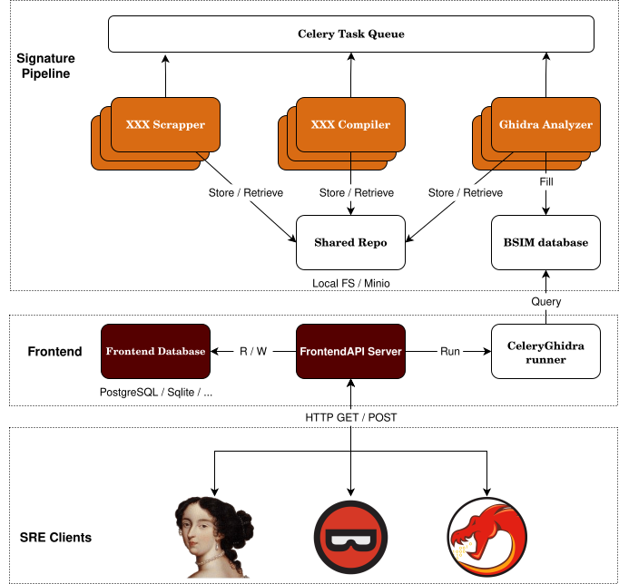

# SightHouse Architecture

SightHouse is designed to provide a streamlined and automated workflow for firmware or program 
analysis, enabling function identification and framework origin tracing. The process follows a 
modular pipeline that integrates scraping, compilation, signature extraction, and user analysis
in a cohesive flow.

Each step in the workflow is optimized for scalability and adaptability
to handle various project types and analysis needs. Below is an overview
of the key stages in the SightHouse workflow:

- **Scraping**: Open-source SDK projects are collected from platforms
like PlatformIO, with their metadata stored in structured entities (Package and PackageVersion). 
Scraper can also directly add compiled projects to be analyzed, for example, we could create a
scraper for Linux packages.

- **Compilation**: The collected source code is dispatched to worker
compilers for building executables files, ensuring compatibility with
various build systems like PlatformIO, CMake, and AutoTools.

- **Signature Extraction**: The backend processes compiled files, extracting function 
signatures and storing them in a robust database for future analysis.

- **Frontend Analysis**: The standalone frontend matches programs ranging from Windows PE to raw 
bare-metal firmware binaries using the extracted signatures in the database, providing users 
with detailed function mapping, renaming, and (TODO prototypes insights).

By dividing the workflow into specialized, interconnected components, SightHouse achieves a 
balance of flexibility, efficiency, and extensibility, ensuring that each stage performs its 
role independently while contributing to the overall analysis process. The overall architecture
of SightHouse is shown below.

<figure markdown="span">
  
  <figcaption>SightHouse Architecture</figcaption>
</figure>

*The diagram is clickable*

we share with you some dockers to deploy your own pipeline or frontend or if you want to have a ghidra headless:

```
docker pull ghcr.io/quarkslab/sighthouse/sighthouse:latest
docker pull ghcr.io/quarkslab/sighthouse/sighthouse-pipeline:latest
docker pull ghcr.io/quarkslab/sighthouse/sighthouse-frontend:latest

docker pull ghcr.io/quarkslab/sighthouse/elastic_bsim:latest
docker pull ghcr.io/quarkslab/sighthouse/ghidra-bsim-postgres:latest
docker pull ghcr.io/quarkslab/sighthouse/create_bsim_db:latest

docker pull ghcr.io/quarkslab/sighthouse/ghidraheadless:latest
docker pull ghcr.io/quarkslab/sighthouse/ghidraheadless-python3:latest
```
