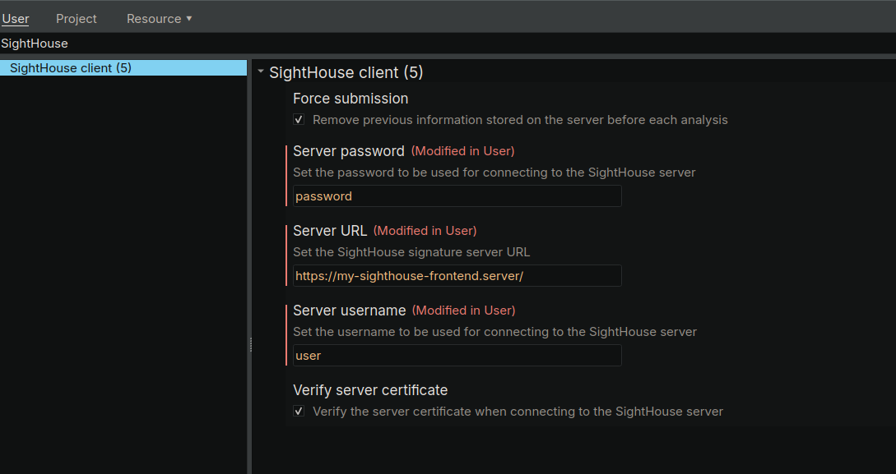
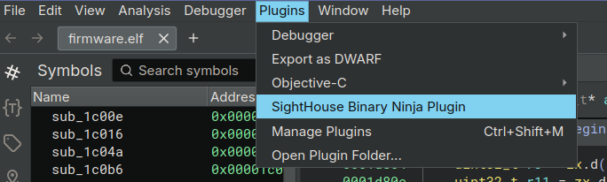
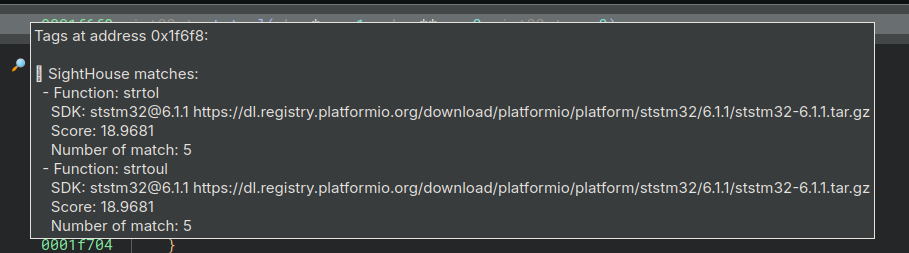

# Binary Ninja 

<div markdown="span" style="float:right;margin-left:20px;margin-top:-90px;">

  { width="120" }

</div>

## Installation

The easiest way to install the Binary Ninja plugin is to install
the `sighthouse-client` package and then run the following commands.

```bash
pip install sighthouse-client
sighthouse client install binja
```

It's also possible to install it from the repository:

```bash
git clone https://github.com/quarkslab/sighthouse
cd sighthouse/sighthouse-client
# Install script
make install_binja 
```

After restarting Binary Ninja, there should be a new entry inside the plugins list.


## Usage

After restarting Binary Ninja, go under *Edit* -> *Settings* and search for SightHouse. You will get a menu 
to enter your informations such as username and password like this one:

<figure markdown="span">
  { width="614" }
  <figcaption>Settings for Binary Ninja Plugin</figcaption>
</figure>

Then go under *Plugin* and click on the one corresponding to SightHouse.

<figure markdown="span">
  { width="614" }
  <figcaption>SightHouse Plugin Entry</figcaption>
</figure>

Once the plugin finished if you get some matches they will be added as tags like this:

<figure markdown="span">
  { width="614" }
  <figcaption>SightHouse Matches</figcaption>
</figure>
