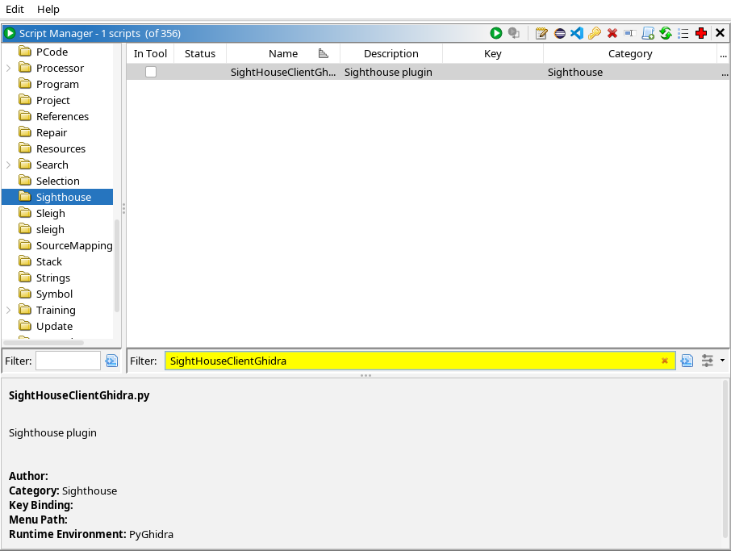
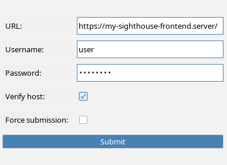
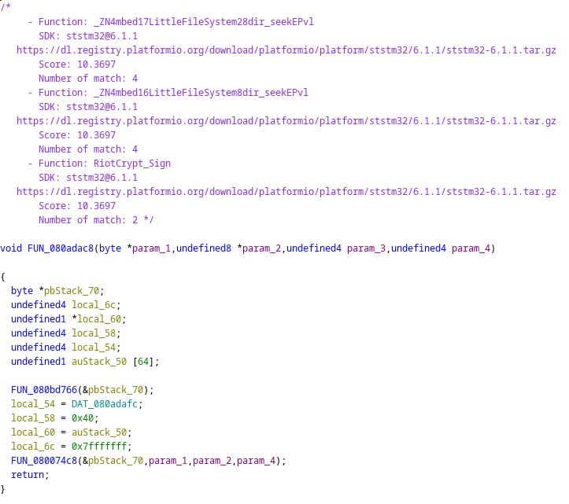

# Ghidra

<div markdown="span" style="float:right;margin-left:20px;margin-top:-90px;">

  { width="120" }

</div>

## Installation

In order to run the SightHouse plugin, you will need at least [Ghidra 11.3](https://github.com/NationalSecurityAgency/ghidra/releases/tag/Ghidra_11.3_build)
as it now come with Python 3 support thought pyGhidra. 

We advise you to launch for a first time ghidra before installing this plugin.

The easiest way to install the Ghidra plugin is to install the `sighthouse-client` 
package and then run the following commands.

```bash
pip install sighthouse-client
sighthouse client install ghidra --ghidra-install-dir /path/to/ghidra
```

It's also possible to install it from the repository:

```bash
git clone https://github.com/quarkslab/sighthouse
cd sighthouse/sighthouse-client
# Deactivate previous virtual env
deactivate 
# Install script
yes | GHIDRA_INSTALL_DIR=/path/to/ghidra make install_ghidra 
```

The script will search for pyGhidra virtual environment, install SightHouse 
client dependencies and then ask you where you want to copy your script.  

## Usage

After restarting Ghidra, open a program and run the `SightHouseClientGhidra.py` script from 
the *Script Manager* window. 

<figure markdown="span">
  { width="614" }
  <figcaption>Ghidra Script Manager Window</figcaption>
</figure>

When running the script, you get prompted with the following window: 

<figure markdown="span">
  { width="400" }
  <figcaption>Running SightHouse Ghidra Plugin</figcaption>
</figure>

Enter all the required information and press **Submit**. Once the script is done, you should get matches 
like this:

<figure markdown="span">
  { height="512" }
  <figcaption>SightHouse Matches</figcaption>
</figure>
