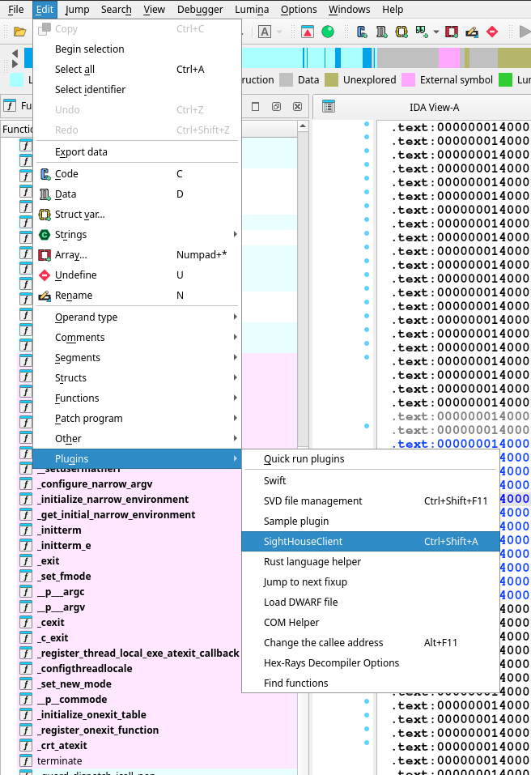
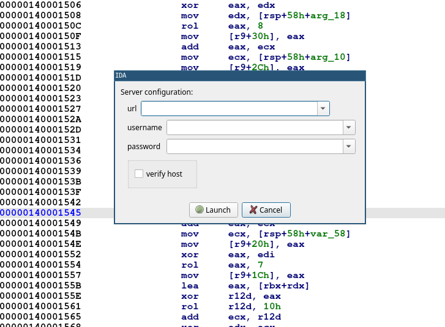
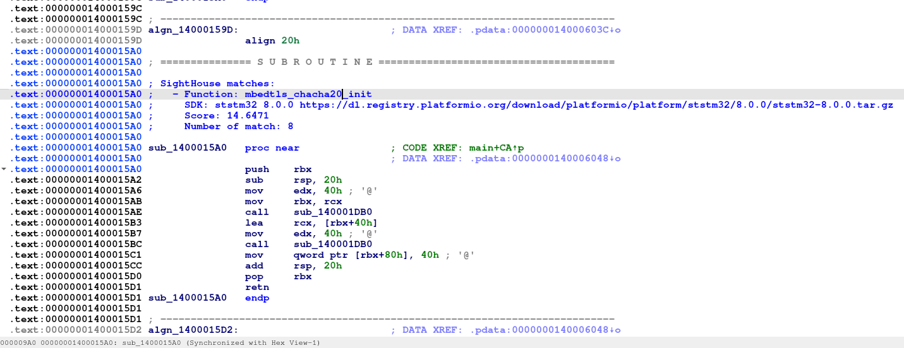

# IDA

<div markdown="span" style="float:right;margin-left:20px;margin-top:-90px;">

  { width="120" }

</div>

## Installation

The easiest way to install the IDA plugin is to install the `sighthouse-client` 
package and then run the following commands.

```bash
pip install sighthouse-client
sighthouse client install ida --ida-dir /path/to/ida_dir
```

It's also possible to install it from the repository:

```bash
git clone https://github.com/quarkslab/sighthouse
cd sighthouse/sighthouse-client
# Install script
IDA_DIR=/path/to/ida_dir make install_ida 
```


## Usage

After restarting IDA, go under *Edit* -> *Plugins* and run the SightHouse Client Plugin. 

<figure markdown="span">
  { height="512" }
  <figcaption>SightHouse Plugin Entry</figcaption>
</figure>

Upon running, you should get a prompt asking for credentials and server endpoint like this one:

<figure markdown="span">
  { height="512" }
  <figcaption>SightHouse Plugin</figcaption>
</figure>

Once the plugin finished running, the matches are available as comment and should look something similar to 
this:

<figure markdown="span">
  { width="614" }
  <figcaption>SightHouse Matches</figcaption>
</figure>
