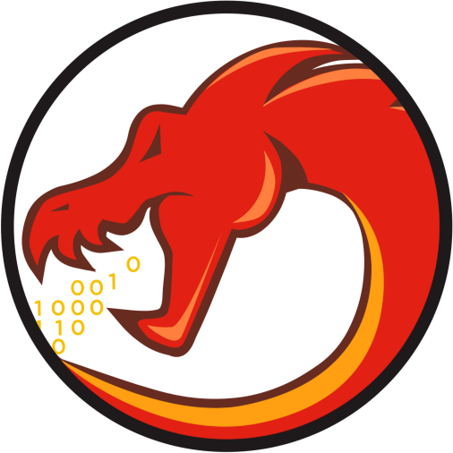
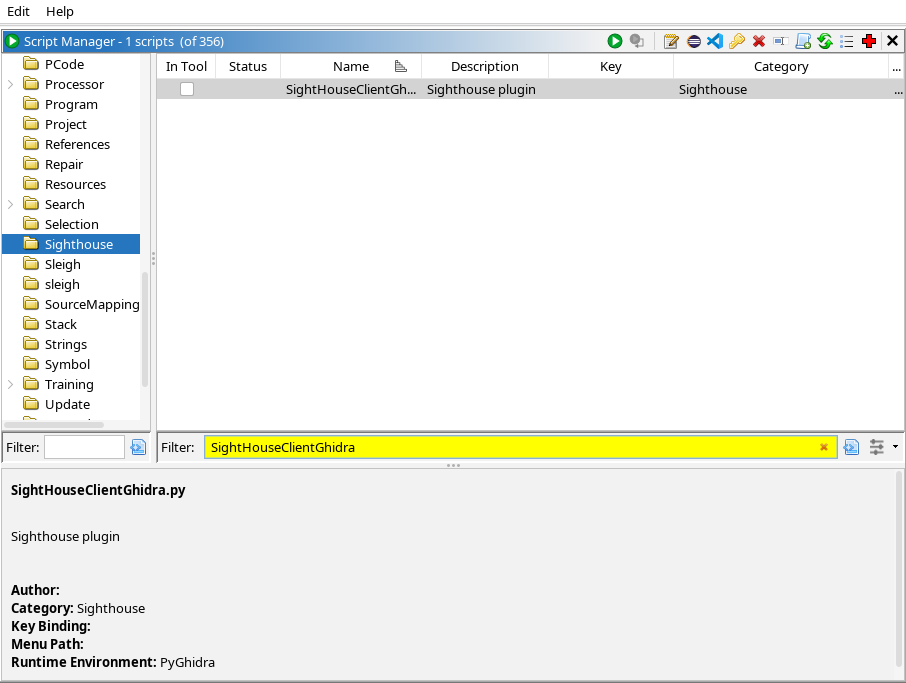
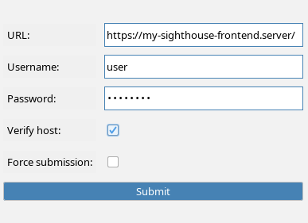
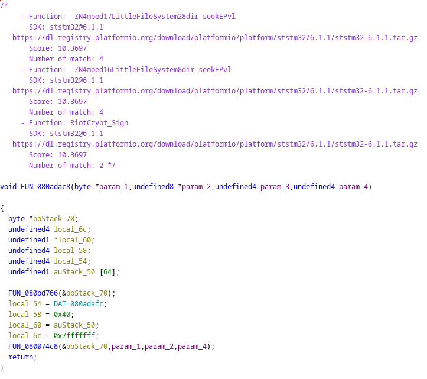
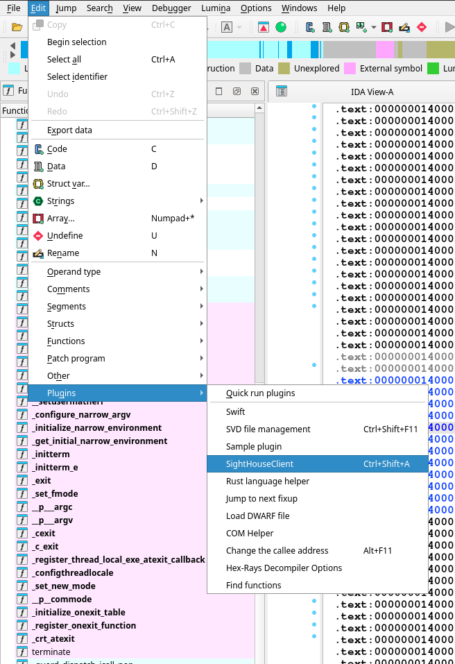
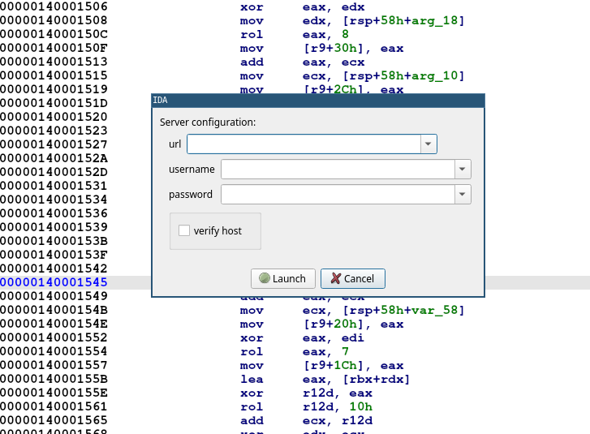
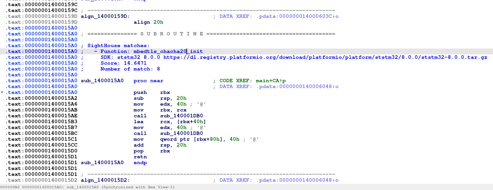
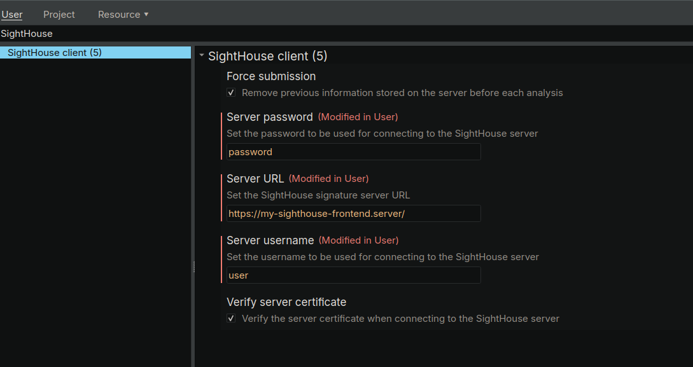
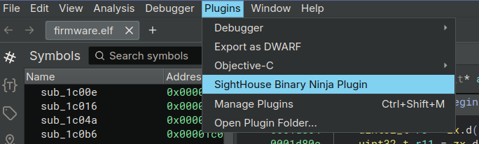
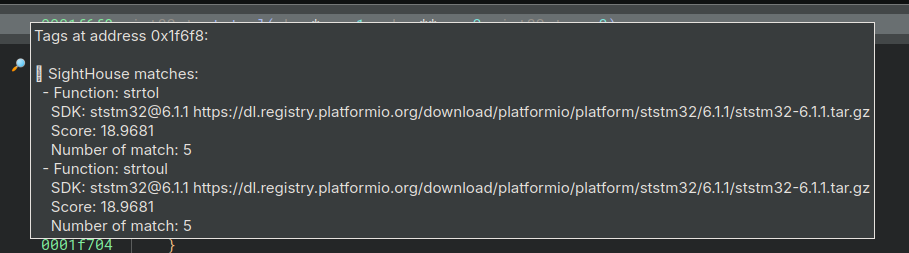

# Running the clients

To interact with the frontend API, SightHouse offers plugins tailored to different SRE tools, 
including [Binary Ninja](https://binary.ninja/), [Ghidra](https://ghidra-sre.org/), and [IDA Pro](https://hex-rays.com/). 

Each plugin is built upon a shared Python 3 package that contains the core functionality, ensuring consistency 
and reducing code duplication. This section assume you installed your plugin according to the instructions 
available [here](installation.md#installing-the-sre-clients).

### Ghidra 

Our plugin works only on pyghidra you should launch $GHIDRA_INSTALL_DIR/support/pyghidraRun and not the classical ghidra.

  { width="120" }

After restarting Ghidra, open a program and run the `SightHouseClientGhidra.py` script from 
the *Script Manager* window. 

<figure markdown="span">
  { width="614" }
  <figcaption>Ghidra Script Manager Window</figcaption>
</figure>

When running the script, you get prompted with the following window: 

<figure markdown="span">
  { width="400" }
  <figcaption>Running SightHouse Ghidra Plugin</figcaption>
</figure>

Enter all the required information and press **Submit**. Once the script is done, you should get matches 
like this:

<figure markdown="span">
  { height="512" }
  <figcaption>SightHouse Matches</figcaption>
</figure>

### IDA 

  { width="120" }

After restarting IDA, go under *Edit* -> *Plugins* and run the SightHouse Client Plugin. 

<figure markdown="span">
  { height="512" }
  <figcaption>SightHouse Plugin Entry</figcaption>
</figure>

Upon running, you should get a prompt asking for credentials and server endpoint like this one:

<figure markdown="span">
  { height="512" }
  <figcaption>SightHouse Plugin</figcaption>
</figure>

Once the plugin finished running, the matches are available as comment and should look something similar to 
this:

<figure markdown="span">
  { width="614" }
  <figcaption>SightHouse Matches</figcaption>
</figure>

### Binary Ninja

  { width="120" }

After restarting Binary Ninja, go under *Edit* -> *Settings* and search for SightHouse. You will get a menu 
to enter your informations such as username and password like this one:

<figure markdown="span">
  { width="614" }
  <figcaption>Settings for Binary Ninja Plugin</figcaption>
</figure>

Then go under *Plugin* and click on the one corresponding to SightHouse.

<figure markdown="span">
  { width="614" }
  <figcaption>SightHouse Plugin Entry</figcaption>
</figure>

Once the plugin finished if you get some matches they will be added as tags like this:

<figure markdown="span">
  { width="614" }
  <figcaption>SightHouse Matches</figcaption>
</figure>

