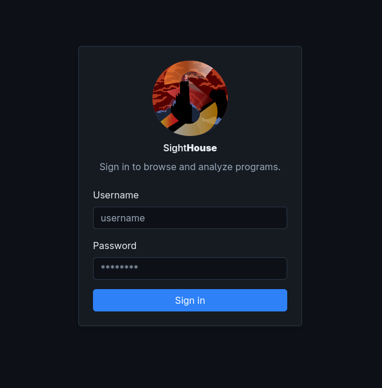
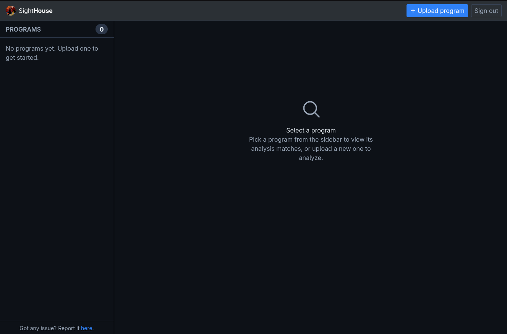
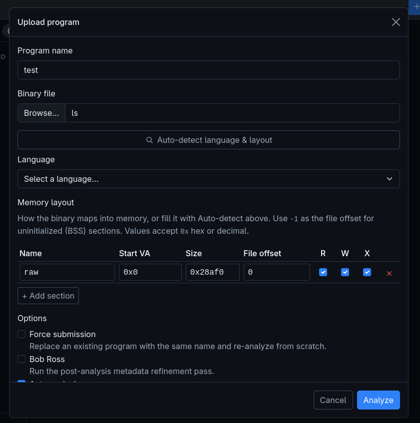
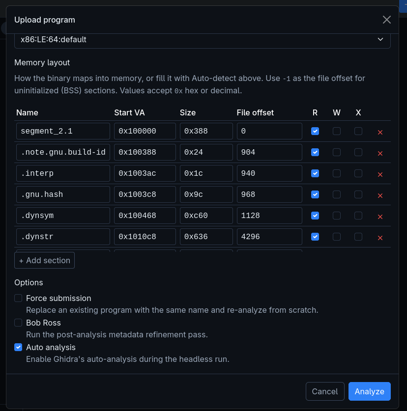
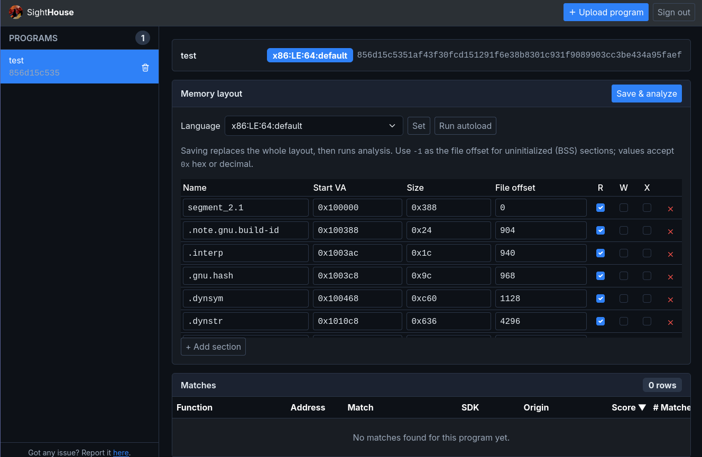

# Web Client

SightHouse also features a web interface allowing you to quickly check for matches on a 
given program. No configuration is needed on the client side, the frontend exposes 
it on the same URL as the API.

The first step is to go to the server URL, by default `http://localhost:6671`, and log in using 
your credentials.

<figure markdown="span">
  { width="614" }
  <figcaption>Login on the web interface</figcaption>
</figure>

Once you are logged in, you should see the following interface allowing you to check your 
existing programs as well as add new ones.

<figure markdown="span">
  { width="614" }
  <figcaption>Main web interface</figcaption>
</figure>

To add a new program, click on *Upload program* which will open a popup.

<figure markdown="span">
  { width="614" }
  <figcaption>Upload popup</figcaption>
</figure>

This popup will ask for a program name and to choose a file locally on your system. 
Once selected, you can either enter the architecture and memory mapping manually 
(needed for bare metal firmware) or choose the *Auto-detect* feature. 

Auto-detect will send the program to the backend and try to automatically load it 
using the built-in importers supported by Ghidra like ELF, PE or MachO. 

Once that's done, you can select the classic options (common with the other clients)
and click on *Analyze*. 

<figure markdown="span">
  { width="614" }
  <figcaption>Starting analysis</figcaption>
</figure>

Once the analysis is finished, the result will be available under the matches table.

<figure markdown="span">
  { width="614" }
  <figcaption>Program overview</figcaption>
</figure>
