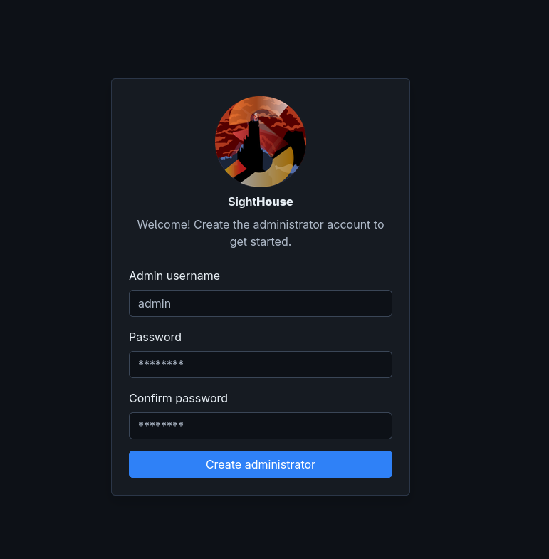
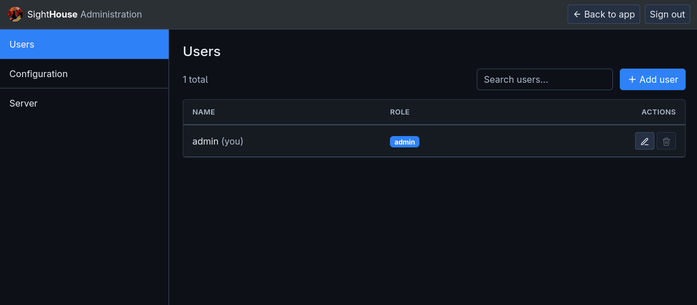
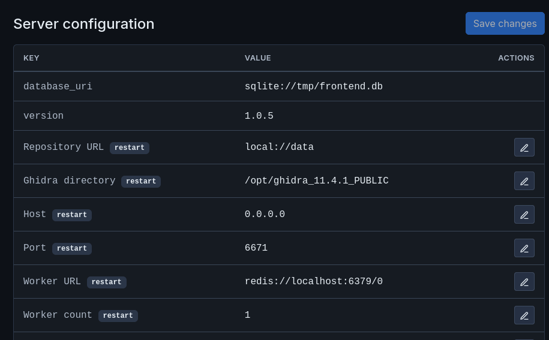
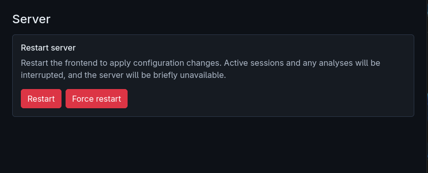

# Quickstart

!!! tip "Not installed yet?"
    If you haven't installed SightHouse yet, follow the installation process described [here](installation.md) first.

Once installed, SightHouse frontend can be run with the following minimal command:

```bash
$ sighthouse frontend start -d sqlite:////data/frontend.db
```

This command will start a frontend server listening on http://localhost:6671
without most of the configuration set. You can fill these configuration options 
later in the administration panel (see [Administration & Setup](#administration-setup)).

Deploying all the required services with the correct setup can be time-consuming and
error-prone. To simplify this process, we provide a Docker Compose file that lets you
deploy an instance of the frontend:

```yml
services:
  redis:
    image: redis:7
    volumes:
      - ./data/redis:/data

  bsim_postgres:
    image: ghcr.io/quarkslab/sighthouse/ghidra-bsim-postgres:latest
    volumes:
      - ./data/postgres:/home/user/ghidra-data

  sighthouse_frontend:
    image: ghcr.io/quarkslab/sighthouse/sighthouse-frontend:1.0.6
    command: >
      frontend start
      -g /ghidra -d sqlite:////data/frontend.db
      -r local://data
      -w redis://redis:6379/0
      -b postgresql://user@bsim_postgres:5432/bsim
      -f postgresql://user@bsim_postgres:5432/bsim
    ports:
      - "6671:6671"
    volumes:
      - ./data/frontend:/data
    depends_on: [bsim_postgres, redis]
```

The frontend can then be started with `docker compose up -d`. The API will be available
on port 6671. A complete example is available [here](https://github.com/quarkslab/sighthouse/tree/main/docker/frontend). 

!!! warning "No default database"
    By default, the server does have a database so you will need to run the pipeline 
    to generate one, you can learn how to do it [here](../signature-pipeline/quickstart.md).

## Parameters

Only `--database` is required to start the frontend. The remaining parameters can
either be passed on the command line or left empty and configured later in the
[administration panel](#administration-setup).

- **database** (required): The frontend saves user and program information in a dedicated
  database, allowing you to query analysis results. Supported database formats include
  SQLite and PostgreSQL.
- **ghidradir**: The path to the Ghidra directory that the runner will use to analyze
  and query signatures from programs.
- **repo**: A location for storing analyzed files. This can be a local directory on the
  filesystem or an S3-compatible URL.
- **worker-url**: The URL of the Redis server used by SightHouse's Celery workers to
  perform program analysis. A Redis server is required to start the frontend
  (for example, `redis://redis:6379/0`).
- **bsim-url**/**fidb-url**: A list of BSIM/FIDB URLs that analyzers will use to query
  signatures.

Here's a complete command to start the frontend:

```bash
$ sighthouse frontend start -d sqlite:////data/frontend.db \
  -g /ghidra -r local://data -w redis://redis:6379/0 \
  -b postgresql://user@bsim_postgres:5432/bsim \
  -f postgresql://user@bsim_postgres:5432/bsim
```

## User Management

SightHouse employs user-based permission management, requiring you to create a user. You
can do this with the following command:

```bash
$ sighthouse frontend add-user -d <database> <user> -p <password> [--admin]
```

You may leave the password option empty, which will generate a random password for the
new user.

## Administration & Setup

Upon first boot, the server will not have any users (except one you may have added
manually via the CLI), so a setup wizard is shown, allowing you to create the first
administrator.

<figure markdown="span">
  { width="614" }
  <figcaption>Setup Wizard</figcaption>
</figure>

The server can have one or more administrators, and roles can be added or removed
dynamically. Once the setup is finished, administrators can access the administration
page by logging in first and clicking the *Admin* button in the top-right corner. It
looks like this:

<figure markdown="span">
  { width="1024" }
  <figcaption>SightHouse Administration panel</figcaption>
</figure>

The *Users* tab lets you manage users from your browser, the same way the CLI does. You
can create users or administrators, reset their passwords, or delete users.

You can edit the server configuration from the *Configuration* tab:

<figure markdown="span">
  { width="800" }
  <figcaption>Configuration panel</figcaption>
</figure>

This page lets you modify the server's running configuration, such as the path to
Ghidra and the various signature servers. These fields are populated by the CLI when the
server starts.

!!! warning "Additional Setup"
    If you started the server by setting only the database switch, you will have to fill
    in the empty options, such as the Ghidra directory, worker URL, and BSIM/FIDB
    signature servers.

Updating some fields may require a server restart, which you can do by going to *Server*
and clicking *Restart*.

<figure markdown="span">
  { width="800" }
  <figcaption>Server panel</figcaption>
</figure>
