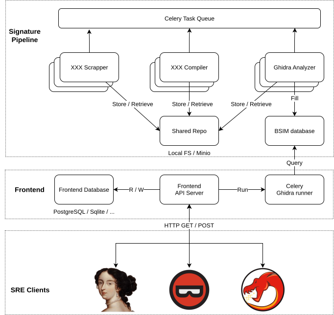

# Welcome to SightHouse Documentation 

## What is SightHouse ?

SightHouse is a tool designed to assist reverse engineers by collecting
information and metadata from programs and recognizing similar functions. To maximize data 
collection for function extraction, SightHouse automatically scrapes, compiles, and analyzes 
new projects. This process allows us to continuously enhance and expand the database with new
signatures.

## What are you looking for ? 

You either ended up on your own or somebody <s>forced</s> incited you to test SightHouse. In any case, you 
need to know what you want to install before proceeding. This mindchart should guide you 
(*The diagram is clickable*)

<figure markdown="span">
  
  <figcaption>SightHouse Mindchart</figcaption>
</figure>

- If you want to search for signatures inside you program, go [here](clients/quickstart/).
- If you have an **existing** database and want to host your own SightHouse server, go [here](frontend/quickstart/).
- You want to create your own database and/or your own signatures, go [here](signature-pipeline/quickstart/).

In case of doubt, do not hesitate to contact the developers :) 

## SightHouse Architecture

SightHouse is designed to provide a streamlined and automated workflow for firmware or program 
analysis, enabling function identification and framework origin tracing. The process follows a 
modular pipeline that integrates scraping, compilation, signature extraction, and user analysis
in a cohesive flow.

Each step in the workflow is optimized for scalability and adaptability
to handle various project types and analysis needs. Below is an overview
of the key stages in the SightHouse workflow:

- **Scraping**: Open-source SDK projects are collected from platforms
like PlatformIO, with their metadata stored in structured entities (Package and PackageVersion). 
Scraper can also directly add compiled projects to be analyzed, for example, we could create a
scraper for Linux packages.

- **Compilation**: The collected source code is dispatched to worker
compilers for building executables files, ensuring compatibility with
various build systems like PlatformIO, CMake, and AutoTools.

- **Signature Extraction**: The backend processes compiled files, extracting function 
signatures and storing them in a robust database for future analysis.

- **Frontend Analysis**: The standalone frontend matches programs ranging from Windows PE to raw 
bare-metal firmware binaries using the extracted signatures in the database, providing users 
with detailed function mapping, renaming, and prototypes insights.

By dividing the workflow into specialized, interconnected components, SightHouse achieves a 
balance of flexibility, efficiency, and extensibility, ensuring that each stage performs its 
role independently while contributing to the overall analysis process. The overall architecture
of SightHouse is shown below.

<figure markdown="span">
  
  <figcaption>SightHouse Architecture</figcaption>
</figure>

*The diagram is clickable*

