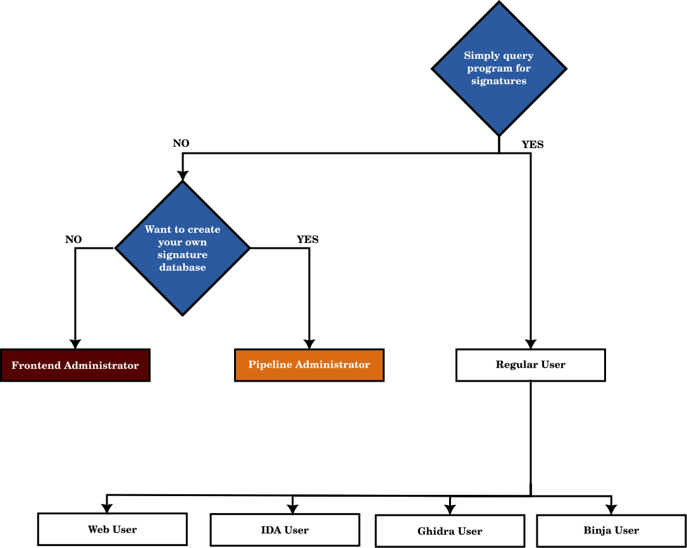

# Welcome to SightHouse Documentation 

## What is SightHouse ?

SightHouse is a tool designed to assist reverse engineers by collecting
information and metadata from programs and recognizing similar functions. To maximize data 
collection for function extraction, SightHouse automatically scrapes, compiles, and analyzes 
new projects. This process allows us to continuously enhance and expand the database with new
signatures.

The project is divided into three parts:

- **Signature Pipeline**: Automatically feeds the signature database with new projects by
  scraping, compiling, and analyzing them.
- **Frontend**: A server that allows users to query signatures from the database produced by
  the signature pipeline.
- **SRE Clients**: Plugins tailored for each Software Reverse Engineering tool that interact
  with the frontend. We currently support IDA, Ghidra, Binary Ninja, and a Web client.

<video autoplay muted controls>
  <source src="assets/images/demo-pwn2own.mp4" type="video/mp4"/>
</video>

## What are you looking for ? 

You either ended up on your own or somebody <s>forced</s> incited you to test SightHouse. In any case, you 
need to know what you want to install before proceeding. This mindchart should guide you 
(*The diagram is clickable*)

<figure markdown="span">
  
  <figcaption>SightHouse Mindchart</figcaption>
</figure>

- If you want to search for signatures inside your program as a **SRE Client**, go [here](clients/index.md) and pick your tool (installation instructions are on each tool's page).
- If you have an **existing** database and want to host your own SightHouse server (**Frontend**), go [here](frontend/quickstart.md).
- You want to create your own database and/or your own signatures (**Signature Pipeline**), go [here](signature-pipeline/quickstart.md).

Not sure yet, or want to see if this fits your use case first? Check the [FAQ](faq.md).

In case of doubt, do not hesitate to contact the developers :) 

## Try it now

Already have a SightHouse Frontend running (yours or your team's)? Install the client for your
tool and start querying right away:

- [Ghidra](clients/ghidra.md)
- [IDA](clients/ida.md)
- [Binary Ninja](clients/binja.md)
- [Web](clients/web.md)

Don't have one yet? There is no public SightHouse instance: you'll need to build a signature
database with the [Signature Pipeline](signature-pipeline/quickstart.md) and serve it with the
[Frontend](frontend/quickstart.md) first.

Want to know how the pipeline, frontend, and clients fit together internally? See the
[Architecture](architecture.md) page.

## Changelog

- **1.0.6**: Add the SightHouse web panel; add server-side Function ID support; revamp BobRoss; improve documentation.
- **1.0.5**: Migrate object storage from MinIO to RustFS; improve test suite.
- **1.0.4**: Improve Docker Compose setup and deployment scripts.
- **1.0.3**: Update Docker images.
- **1.0.2**: Improve the client installer.
- **1.0.1**: Improve documentation.
- **1.0.0**: First public release of SightHouse.
